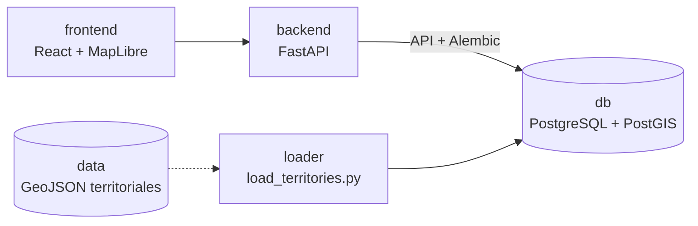

# Territorio Argentino

MVP local, no productivo, para explorar indicadores territoriales de Argentina sobre
geometrias PostGIS. El objetivo actual es validar la arquitectura para provincias,
municipios y radios censales antes de crecer en datos y funcionalidades.

Visor territorial local con PostgreSQL/PostGIS, FastAPI, React y MapLibre.


## Servicios

- `db`: PostgreSQL con PostGIS.
- `backend`: API FastAPI que aplica migraciones Alembic y publica niveles
  territoriales, territorios, indicadores y GeoJSON para el mapa.
- `frontend`: visor React + MapLibre con modos 2D y 3D.
- `loader`: tarea manual para cargar GeoJSON territoriales en PostGIS.

## Arquitectura



El modelo central es `territories`: una unidad territorial puede ser una provincia,
un municipio o un radio censal. Cada territorio guarda:

- `level_id`: `province`, `municipality` o `census_radius`.
- `source`: fuente de la geometria, por ejemplo `IGN`.
- `external_id`: codigo original del dataset fuente.
- `parent_id`: relacion jerarquica opcional con otro territorio.
- `metadata`: propiedades originales del GeoJSON.
- `geom`: geometria PostGIS.

## Fuentes de datos y trazabilidad

Este proyecto busca que el origen y el tratamiento de los datos sean auditables
por usuarios tecnicos y no tecnicos. Los archivos cargados en la base conservan
las propiedades originales del GeoJSON en `metadata`; los identificadores
internos se normalizan para evitar depender del orden de filas o de ids
temporales de cada servicio.

Fuentes usadas actualmente:

| Dataset usado | Archivo/capa en el proyecto | Uso | Fuente institucional y link |
| --- | --- | --- | --- |
| Provincias con poblacion del Censo 2022 | `data/poblacion_provincias_indec_2022.geojson` | Geometria provincial e indicadores `poblacion_total`, `mujeres`, `varones` y `otro_x`. | Capa publicada por IGN en [Capas SIG](https://www.ign.gob.ar/NuestrasActividades/InformacionGeoespacial/CapasSIG) como `Poblacion por provincia CNPHyV 2022 (provisorio)`, con datos censales del [INDEC - Censo 2022](https://www.indec.gob.ar/indec/web/Nivel4-Tema-2-18-77). |
| Municipios, comunas, juntas y gobiernos locales disponibles en IGN | WFS `ign:municipio`, normalizado en `data/municipios_ign.geojson` | Poligonos municipales/locales para el mapa. | [IGN WFS GetCapabilities](https://wms.ign.gob.ar/geoserver/ows?service=wfs&version=1.1.0&request=GetCapabilities) y descarga GeoJSON con `typeName=ign:municipio`: [GetFeature](https://wms.ign.gob.ar/geoserver/ows?service=wfs&version=1.1.0&request=GetFeature&typeName=ign:municipio&outputFormat=application/json&srsName=EPSG:4326). |
| Gobiernos locales de Santiago del Estero y validacion externa de codigos | `gobiernos-locales.geojson` de Georef | Suplemento de poligonos faltantes para Santiago del Estero y verificacion de casos con `in1` faltante o duplicado. | [Georef - descarga de base completa](https://www.argentina.gob.ar/georef/descarga-de-la-base-completa) y endpoint usado: [gobiernos-locales.geojson](https://apis.datos.gob.ar/georef/api/v2.0/gobiernos-locales.geojson). |
| Codigos geograficos de referencia | No se carga como dataset independiente | Referencia conceptual para interpretar codigos territoriales nacionales. | [INDEC - Codigos geograficos del Censo 2022](https://redatam.indec.gob.ar/redarg/CENSOS/CPV2022/Docs/codcart.htm). |
| Recorridos de colectivos de CABA | `data/colectivos_recorridos.geojson` opcional | Overlay de lineas de transporte sobre el mapa territorial. | [BA DATA - Colectivos: recorridos](https://data.buenosaires.gob.ar/es_AR/dataset/colectivos-recorridos), recurso GeoJSON. |

Tratamientos y fusiones aplicadas:

- El archivo provincial ya llega como una capa tematica: combina geometria
  territorial publicada por IGN con atributos censales del CNPHyV 2022. El
  proyecto no vuelve a fusionar esos datos; solo carga los campos incluidos.
- El mapa municipal se arma principalmente con `ign:municipio`. Como esa capa no
  trae poligonos validos para Santiago del Estero, se agregan 165 gobiernos
  locales desde Georef para la provincia `86`.
- Georef tambien se usa como fuente de contraste para correcciones puntuales:
  cuatro `in1` faltantes fueron completados por coincidencia de nombre y
  contencion espacial; `Hardy` se recodifico de `822784` a `822808`.
- Los dos poligonos IGN de `Machagai` comparten el mismo `in1 = 220476`; se
  fusionaron en un unico `MultiPolygon` para preservar ambas partes de la
  geometria y evitar duplicados.
- Cuatro filas sin identificador confiable (`Guer Aike`, `Malvinas`, `El
  Caiman`, `Colonia Cerrito`) quedaron excluidas por ahora. No bloquean la
  produccion del mapa y pueden agregarse mas adelante si se confirma su estatus
  administrativo.
- Los radios censales no se cargan todavia. `CENSUS_RADII_GEOJSON` es un insumo
  opcional futuro.

Para auditar estos criterios, revisar `data/README.md`,
`data/municipios_ign_validation_report.json` y los JSON de reglas en `data/`.

## Configuracion local

El proyecto trae valores por defecto para desarrollo. Para personalizarlos:

```powershell
Copy-Item .env.example .env
```

Luego editar `.env` segun sea necesario. El archivo `.env` no se versiona.

Los ejemplos usan `docker compose`. Si tu instalacion expone el binario clasico,
reemplazarlo por `docker-compose`.

## Levantar el proyecto

```powershell
docker compose up -d --build
```

Al arrancar, el backend ejecuta las migraciones Alembic antes de iniciar la API.
Ese flujo es comodo para desarrollo local con una sola instancia. En un entorno con
mas de una replica del backend, conviene separar migraciones y arranque en un job o
step unico previo.

Abrir:

```text
http://localhost:5173
```

## Migraciones

El esquema de base se versiona con Alembic en `backend/alembic/versions`.

Ver revision aplicada:

```powershell
docker compose exec backend alembic -c alembic.ini current
```

Aplicar migraciones manualmente:

```powershell
docker compose exec backend alembic -c alembic.ini upgrade head
```

## Tests

Backend:

```powershell
py -3.12 -m venv .venv
.\.venv\Scripts\python.exe -m pip install -r backend\requirements-dev.txt
.\.venv\Scripts\python.exe -m pytest
```

El directorio `.venv/` es local y no se versiona. Reutilizarlo en corridas
posteriores; no hace falta recrearlo salvo que cambien dependencias o version de
Python. Si `py` no esta disponible, reemplazar `py -3.12` por el ejecutable de
Python 3.12 instalado.

El test de migraciones crea una base temporal y requiere una PostGIS accesible. Usa
por defecto `localhost:5432` con usuario y password `territorio`; se puede ajustar
con `TEST_POSTGRES_HOST`, `TEST_POSTGRES_PORT`, `TEST_POSTGRES_USER`,
`TEST_POSTGRES_PASSWORD` y `TEST_POSTGRES_ADMIN_DB`.

Frontend:

```powershell
cd frontend
npm run test:unit
```

CI:

El workflow `.github/workflows/ci.yml` corre `python -m pytest` con un servicio
PostGIS y `npm run test:unit` para el frontend en cada pull request y en cada
push.

## Cargar territorios

Preparar municipios IGN:

```powershell
docker-compose --profile tools run --rm loader python prepare_ign_municipalities.py
```

Ese comando descarga `ign:municipio` desde el WFS del IGN, deriva `cod_prov`
desde `in1`, escribe `data/municipios_ign_validation_report.json` y solo genera
`data/municipios_ign.geojson` si no hay bloqueantes. Si el reporte marca
`has_blockers: true`, resolver esos casos antes de cargar municipios.

El preparador aplica automaticamente los overrides versionados en
`data/municipality_in1_overrides.json` cuando ese archivo existe. Esos overrides
solo deben usarse para matches verificados contra una fuente externa, y quedan
registrados en el reporte de validacion.

Tambien aplica las exclusiones aceptadas de
`data/municipality_feature_exclusions.json` y las resoluciones de duplicados de
`data/municipality_duplicate_resolutions.json`. Esas reglas permiten producir el
GeoJSON del mapa sin cargar filas fuente que siguen sin identificador confiable
ni perder geometria cuando dos filas representan el mismo municipio.

Mientras `ign:municipio` no incluya poligonos para Santiago del Estero, se puede
sumar el suplemento oficial de Georef:

```powershell
python scripts/prepare_ign_municipalities.py --georef-santiago
```

El suplemento usa la descarga completa de `gobiernos-locales.geojson`, toma solo
features de provincia `86` y rechaza geometria que no sea `Polygon` o
`MultiPolygon`.

El loader principal es:

```text
scripts/load_territories.py
```

Ejecutar:

```powershell
docker-compose --profile tools run --rm loader
```

Dataset incluido por defecto:

```text
data/poblacion_provincias_indec_2022.geojson
```

Variables principales:

- `PROVINCES_GEOJSON`: GeoJSON de provincias con indicadores censales.
- `IGN_MUNICIPALITIES_GEOJSON`: GeoJSON de municipios/localidades censales IGN.
- `CENSUS_RADII_GEOJSON`: GeoJSON de radios censales.
- `CENSUS_RADII_SOURCE`: etiqueta de fuente para radios censales.
- `BA_BUS_ROUTES_GEOJSON`: GeoJSON opcional de recorridos de colectivos BA DATA.

Si un dataset opcional no esta configurado o no existe, el loader lo omite. Si se
configura explicitamente una ruta y el archivo no existe, el loader falla.

Cuando un GeoJSON use nombres de columnas distintos, configurar:

- `PROVINCE_ID_PROPERTY`, `PROVINCE_NAME_PROPERTY`
- `IGN_MUNICIPALITY_ID_PROPERTY`, `IGN_MUNICIPALITY_NAME_PROPERTY`,
  `IGN_MUNICIPALITY_PARENT_PROPERTY`
- `CENSUS_RADIUS_ID_PROPERTY`, `CENSUS_RADIUS_NAME_PROPERTY`,
  `CENSUS_RADIUS_PARENT_PROPERTY`

Las propiedades pueden ser simples, como `nombre`, o anidadas, como `provincia.id`.

El loader usa IDs canonicos para provincias (`provincia_<cod_prov>`) y municipios
IGN (`municipio_<in1>`). Para el GeoJSON provincial incluido, el codigo de
provincia se deriva por nombre usando el mapa documentado en `data/README.md`;
no se usa `gid` como ID canonico.

Para municipios IGN, `in1` debe existir, ser unico y tener seis digitos. El
`parent_id` se deriva de los dos primeros digitos de `in1` y debe existir como
provincia cargada. Si falta el padre, el loader falla en vez de cargar
municipios huerfanos.

Para exploracion local se puede optar explicitamente por saltar filas huerfanas:

```powershell
docker-compose --profile tools run --rm loader python load_territories.py --skip-orphans
```

Ese modo no cambia el comportamiento por defecto. Solo omite features cuyo padre
obligatorio no exista y reporta en consola cada territorio saltado con su padre
faltante.

## Cargar overlays de transporte

Los recorridos de colectivos se cargan como overlay independiente, no como
territorios. Descargar el recurso GeoJSON de
[BA DATA - Colectivos: recorridos](https://data.buenosaires.gob.ar/es_AR/dataset/colectivos-recorridos)
y guardarlo como:

```text
data/colectivos_recorridos.geojson
```

Luego ejecutar:

```powershell
docker-compose --profile tools run --rm loader python load_transport_routes.py
```

Para usar otro archivo:

```powershell
$env:BA_BUS_ROUTES_GEOJSON="/data/mi_archivo.geojson"
docker-compose --profile tools run --rm loader python load_transport_routes.py
```

El loader acepta `LineString` y `MultiLineString`, conserva las propiedades
originales en `metadata`, normaliza campos comunes como `linea`, `recorrido`,
`sentido`, `desde` y `hasta`, y borra recorridos obsoletos de la misma fuente que
ya no aparezcan en el archivo cargado.

La UI abre por defecto en modo transporte: `Colectivos BA` activo y mapa
territorial oculto. Si la tabla `transport_routes` esta vacia, se vera solo el
mapa base hasta cargar el GeoJSON.

## Materialized View de mapa

`/territories` y `/map-data` leen geometria desde `territory_indicator_map_data_mv`,
una Materialized View con una fila por territorio. Esto evita repetir
`ST_AsGeoJSON` en cada request del mapa sin duplicar la geometria por cada
indicador. Los valores se resuelven con un `LEFT JOIN` contra `indicators`, la
misma semantica que usa `/indicator-values`. La geometria se publica con precision
reducida y simplificacion por nivel para que el endpoint siga siendo usable en el
navegador.

La MV tambien publica `bar_center` y `bar_geometry` como propiedades GeoJSON
calculadas en PostGIS. `bar_geometry` usa el footprint simplificado del
territorio para que el prisma 3D cubra toda la provincia, municipio o radio
seleccionado sin calcular geometria en React. Si el frontend no recibe esos
campos, degrada al relieve extruido de poligonos.

La vista puede quedar desactualizada si se insertan o actualizan territorios o
indicadores manualmente. El loader ejecuta:

```sql
REFRESH MATERIALIZED VIEW CONCURRENTLY territory_indicator_map_data_mv;
```

como ultimo paso de la carga, despues de insertar territorios e indicadores. La MV
tiene un indice unico para permitir el refresh concurrente. Si se modifican datos
fuera del loader, ejecutar ese refresh manualmente antes de comparar resultados en
la API.

## API territorial

Endpoints principales:

- `GET /territory-levels`
- `GET /territory-options?level=province`
- `GET /territories?level=municipality`
- `GET /indicators`
- `GET /map-data?level=census_radius&indicator=poblacion_total&year=2022`
- `GET /indicator-values?level=census_radius&indicator=poblacion_total&year=2022`
- `GET /transport-routes?source=BA%20DATA%20colectivos%20recorridos&lines=10`

`/map-data` acepta `territory_ids` para filtrar territorios. `province_ids` queda
soportado como alias temporal de compatibilidad.

Para escalar a radios censales, la direccion recomendada es cachear geometria desde
`/territories` y refrescar valores desde `/indicator-values`. `/map-data` queda como
endpoint de conveniencia para el estado actual del frontend.

## Indicadores

El dataset provincial incluido carga indicadores crudos:

- `poblacion_total` desde `tpvpsc`
- `mujeres` desde `mftvp`
- `varones` desde `vmtvp`
- `otro_x` desde `oxtvp`

Y calcula indicadores derivados por nivel territorial:

- `porcentaje_mujeres`
- `porcentaje_varones`
- `porcentaje_otro_x`
- `densidad_poblacional`

El modo 3D no usa elevacion real del terreno: la altura representa el valor del
indicador seleccionado. La camara 2D/3D se controla aparte de la geometria 3D,
que puede usar el relieve extruido de poligonos o barras por footprint territorial
calculadas en la MV.

## Pasos rapidos para levantarlo

1. Abrir VS Code.
2. Abrir la carpeta `atlas-territorial`.
3. Abrir una terminal en la raiz del proyecto.
4. Ejecutar:

```powershell
docker compose up -d --build
```

5. Abrir en el navegador:

```text
http://localhost:5173
```

6. Cargar datos:

```powershell
docker compose --profile tools run --rm loader
```

Para apagarlo:

```powershell
docker compose down
```
