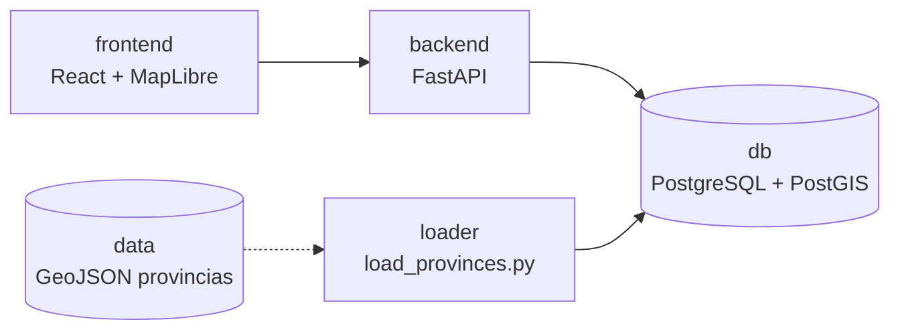

# Territorio Argentino

Visor territorial local con PostgreSQL/PostGIS, FastAPI, React y MapLibre.


## Servicios

- `db`: PostgreSQL con PostGIS.
- `backend`: API FastAPI que publica territorios, indicadores y GeoJSON para el mapa.
- `frontend`: visor React + MapLibre con modos 2D y 3D.
- `loader`: tarea manual para cargar el GeoJSON real en PostGIS.

## Arquitectura



## Configuracion local

El proyecto trae valores por defecto para desarrollo. Para personalizarlos:

```powershell
Copy-Item .env.example .env
```

Luego editar `.env` segun sea necesario. El archivo `.env` no se versiona.

Los ejemplos usan `docker compose`. Si tu instalacion expone el binario clasico,
reemplazarlo por `docker-compose`.

## Levantar el proyecto

```powershell
docker compose up -d --build
```

Abrir:

```text
http://localhost:5173
```

## Cargar provincias reales

El archivo esperado es:

```text
data/poblacion_provincias_indec_2022.geojson
```

Ejecutar:

```powershell
docker compose --profile tools run --rm loader
```

Si se reemplaza el archivo por otro dataset, conservar esa ruta o ajustar `PROVINCES_GEOJSON`
en `.env`.

Fuente declarada por el loader: `INDEC CNPHyV 2022 provisorio / IGN`.

## Indicadores

El script carga indicadores crudos:

- `poblacion_total` desde `tpvpsc`
- `mujeres` desde `mftvp`
- `varones` desde `vmtvp`
- `otro_x` desde `oxtvp`

Y calcula indicadores derivados:

- `porcentaje_mujeres`
- `porcentaje_varones`
- `porcentaje_otro_x`
- `densidad_poblacional`

El modo 3D no usa elevacion real del terreno: la altura representa el valor del indicador
seleccionado.

## Pasos rápidos para levantarlo

1. Abrir VS Code.
2. Abrir la carpeta `atlas-territorial`.
3. Abrir una terminal en la raíz del proyecto.
4. Ejecutar:

```powershell
docker compose up -d --build
```

5. Abrir en el navegador:

```text
http://localhost:5173
```

Para apagarlo:

```powershell
docker compose down
```
